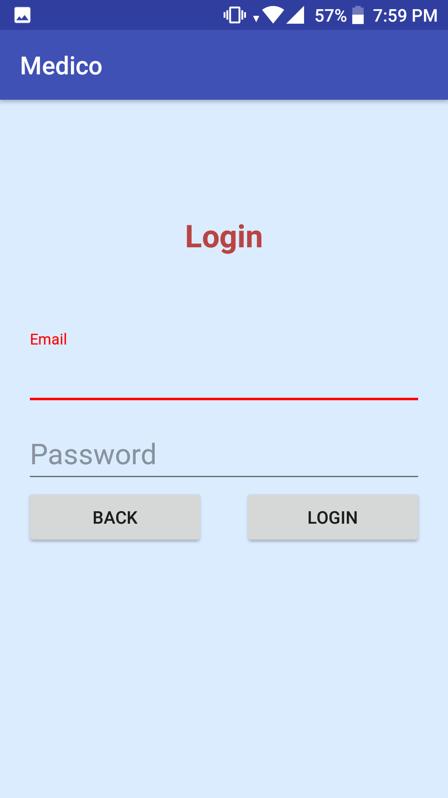
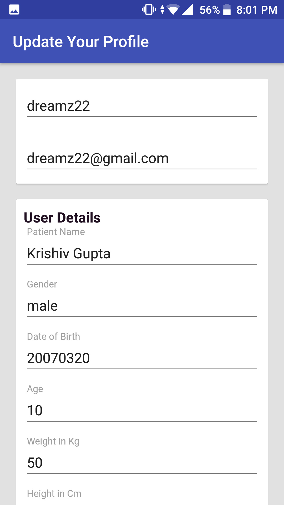
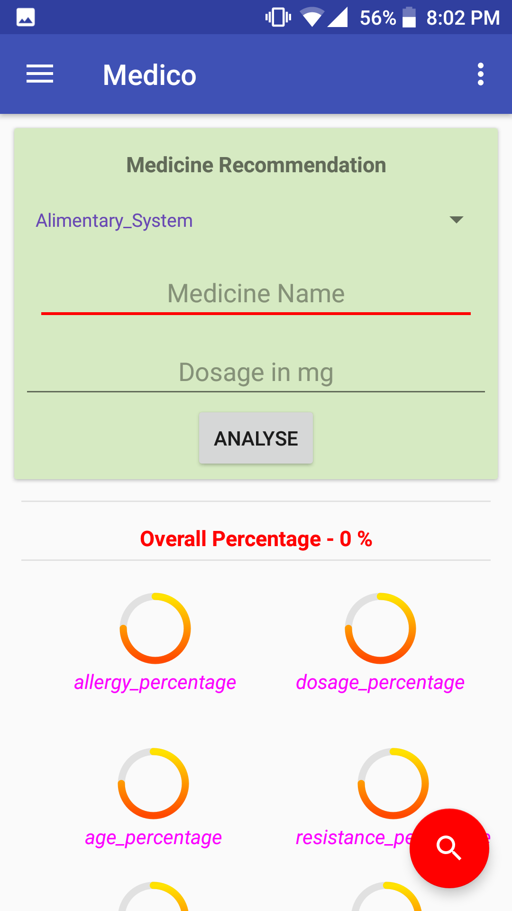
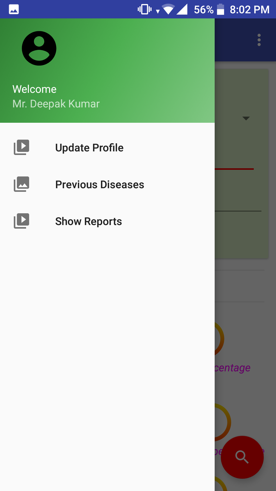

# Medico

### Project Idea

The Idea behind the project is to to find whether a Medicine Composition is Suitable for patient or not. We made a database of more than 200 medicines with their listed composition.  When user will sign up on the platform, he/she has to create his/her profile listing his/her allergies. Using Machine learning algorithms, user will get suggestion of suitable medicines.

### Project Tech Stack :  
- Android
- Microsoft Azure ML
- MongoDB
- NodeJs

# DEMO 

